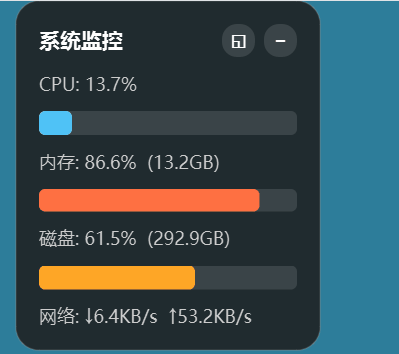

# 系统监控桌面小部件

一个基于 PySide6 + psutil 的 Windows 桌面系统监控小部件，置顶显示在桌面上，实时展示 CPU、内存、磁盘和网络运行状态。



## 功能

- 实时显示 **CPU / 内存 / 磁盘** 使用率（带进度条）
- 实时显示 **网络上传/下载速度**
- 无边框、半透明、圆角设计，支持鼠标拖动调整位置
- 标题栏支持 **最小化** 和 **精简/完整模式切换**
- **精简模式**：只显示三个同心圆环，分别对应 CPU / 内存 / 磁盘 占用率
- **系统托盘图标**：实时显示 CPU / 内存 / 磁盘 三个同心圆环，悬停显示详细数据
- 托盘菜单：显示 / 隐藏 / 退出
- 右键菜单退出

## 运行环境

- Windows
- Python 3.11+
- 使用 [uv](https://github.com/astral-sh/uv) 管理依赖

## 开发运行

```bash
# 进入项目目录
cd sysmonitor-widget

# 使用 uv 运行源码
uv run main.py
```

或者：

```bash
uv run sysmonitor-widget
```

## 测试模式

```bash
uv run main.py --test
```

测试模式会在 3 秒后自动退出，用于验证程序能否正常启动。

## 打包成 exe

已配置 PyInstaller，直接运行：

```bash
uv run pyinstaller --onefile --windowed --name sysmonitor-widget --icon=NONE main.py
```

打包完成后，可执行文件位于：

```
dist/sysmonitor-widget.exe
```

可以直接复制该 exe 到任意位置运行，无需安装 Python。

## 项目结构

```
sysmonitor-widget/
├── main.py                          # 主程序
├── pyproject.toml                   # 项目配置与依赖
├── uv.lock                          # 依赖锁定文件
├── sysmonitor-widget.spec           # PyInstaller 配置文件
├── build/                           # PyInstaller 构建中间文件
├── dist/                            # 打包输出目录
│   └── sysmonitor-widget.exe
├── scripts/
│   ├── install_autostart.py         # 安装并设置开机自启
│   └── remove_autostart.py          # 移除开机自启并删除安装文件
└── README.md                        # 说明文档
```

## 设置开机自启

先打包出 exe，然后运行安装脚本：

```bash
cd sysmonitor-widget
uv run pyinstaller --onefile --windowed --name sysmonitor-widget --icon=NONE main.py
uv run scripts/install_autostart.py
```

这会把程序复制到 `%APPDATA%\SysMonitor\sysmonitor-widget.exe`，并写入注册表 `HKEY_CURRENT_USER\Software\Microsoft\Windows\CurrentVersion\Run`，下次登录时自动启动。

可以在 **任务管理器 > 启动** 中查看是否已启用。

## 取消开机自启

```bash
uv run scripts/remove_autostart.py
```

这会删除注册表启动项，并删除 `%APPDATA%\SysMonitor\` 下的程序文件。

## 自动发布

项目已配置 GitHub Actions 工作流（`.github/workflows/build.yml`）。推送 `v*` 标签时，CI 会自动：

1. 在 Windows 环境下安装依赖
2. 使用 PyInstaller 打包 `sysmonitor-widget.exe`
3. 创建 GitHub Release 并上传 exe 附件

示例：

```bash
git tag v0.3.0
git push origin v0.3.0
```

推送后，可在 [Releases](https://github.com/wx528/sysmonitor-widget/releases) 页面下载自动打包的 exe。

